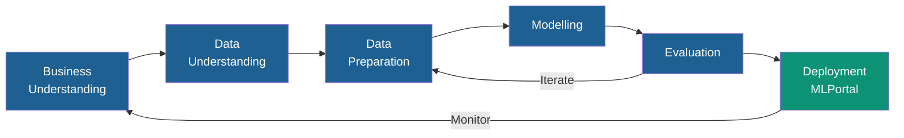
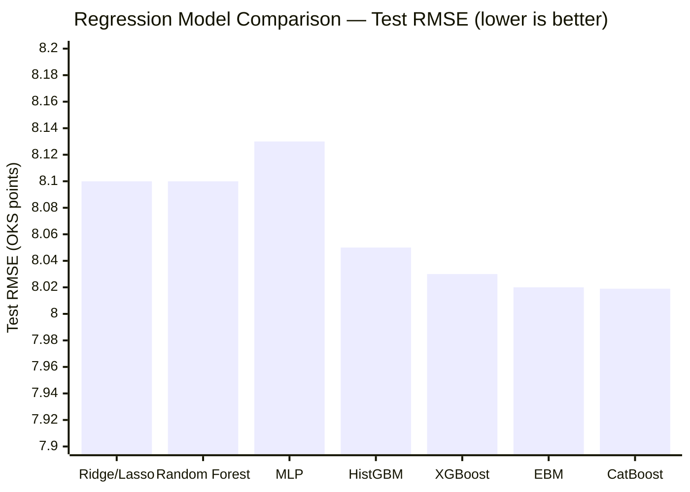
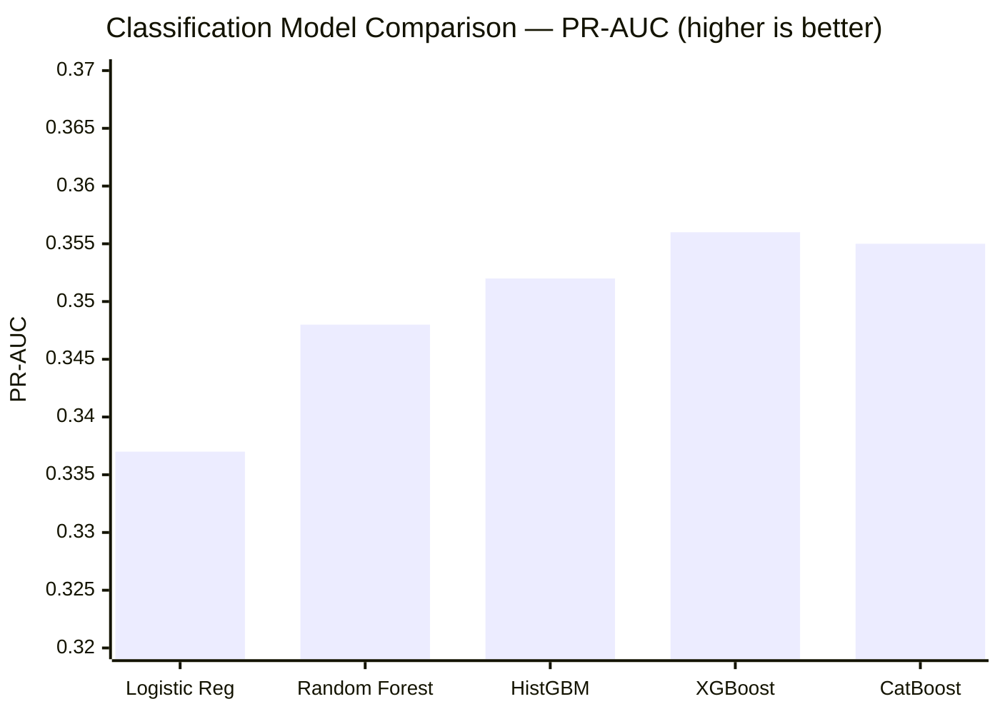
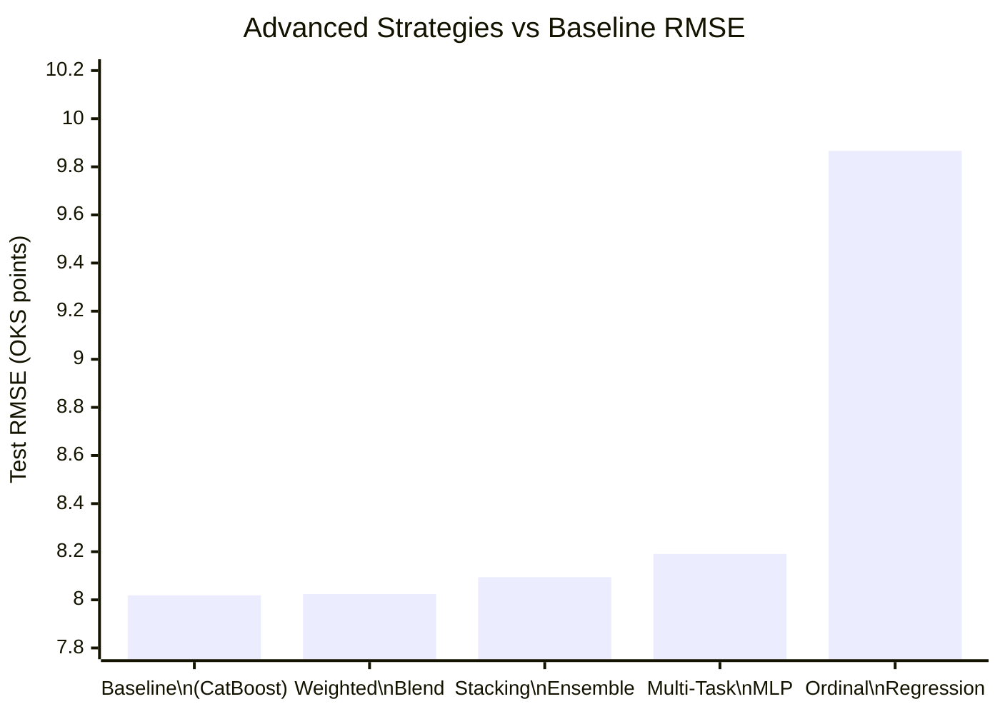
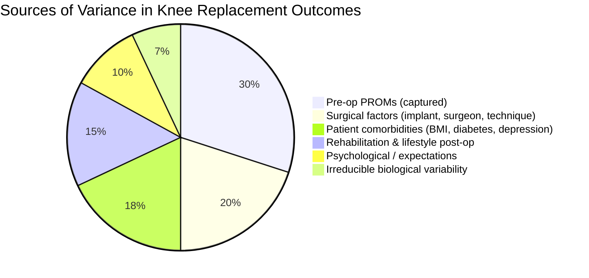
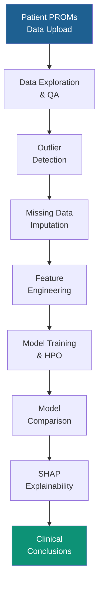

# NHS PROMs — AI-Assisted Knee Replacement Outcome Prediction
## Business Report

**Organisation:** NHS England · EAISI Academy Group Project  
**Cohort:** December 2025  
**Date:** May 2026  
**Authors:** EAISI-NHS Team (Mendel, Gino, Julia, Lalita)  
**Status:** Work in Progress

---

## Executive Summary

This report presents the findings of an AI research programme that applied machine learning and deep learning to two related clinical problems in NHS knee replacement care:

1. **Outcome prediction (PROMs)** — Can pre-operative questionnaire data predict how much a patient will benefit from knee replacement surgery?
2. **Radiological severity grading (X-ray)** — Can a deep learning model classify knee osteoarthritis severity from X-ray images as reliably as a radiologist?

**Key headline findings:**

- Pre-operative questionnaire data alone explains approximately **30% of the variance** in patient outcomes. An R² of 0.30 and RMSE of 8.0 OKS points represents an honest evidence-based ceiling, not a model failure.
- The best regression model (CatBoost) achieves **RMSE = 8.02** and **R² = 0.30**, comparable to published benchmarks on similar datasets.
- A high-precision classifier can flag likely non-benefiters with **≥80% precision**, though at very low recall (~5%), limiting its role to a narrow high-confidence filter.
- A deep learning image classifier (EfficientNet-B4, v3) achieves a **Quadratic Weighted Kappa (QWK) ≥ 0.85** on the 5-class KL grading task — **exceeding** the upper bound of published radiologist inter-rater agreement (κ ≈ 0.65–0.75).
- To materially improve outcome prediction, **linkage with Hospital Episode Statistics (HES)** data is the single highest-impact next step.

---

## 1. Business Context & Problem Statement

### 1.1 Why Knee Replacement Outcomes Matter

NHS England performs approximately **100,000 primary knee replacement procedures** annually at a cost exceeding £1 billion. The NHS PROMs (Patient Reported Outcome Measures) programme collects standardised pre- and post-operative questionnaires for all elective procedures. Despite universal data collection, this rich longitudinal dataset has not been systematically used to:

- Identify patients unlikely to benefit before surgery is performed
- Personalise post-operative care pathways
- Support shared decision-making between clinicians and patients

### 1.2 Research Questions

| # | Business Question | ML Framing |
|---|---|---|
| Q1 | How much will this patient's knee score improve after surgery? | Regression: predict `health_gain = post-op OKS − pre-op OKS` |
| Q2 | Is this patient at high risk of receiving no measurable benefit? | Binary classification: `health_gain < 7` threshold |
| Q3 | Can AI grade osteoarthritis severity from X-rays reliably? | Multi-class ordinal classification: KL grades 0–4 |

---

## 2. Data

### 2.1 PROMs Dataset

- **Source:** NHS England PROMs programme (2016–2019)
- **Volume:** ~87,000 knee replacement patients
- **Features:** 12 Oxford Knee Score (OKS) pre-op items, EQ-5D dimensions (5 items), patient demographics (age, sex, deprivation)
- **Target:** `health_gain` — continuous, range −37 to +47, mean 16.8, standard deviation 9.7
- **Split strategy:** Year-based GroupKFold (prevents temporal data leakage); held-out test set = most recent year

### 2.2 Knee X-ray Dataset (Deep Learning)

- **Source:** Public Kaggle dataset — Knee Osteoarthritis with Severity (Kellgren–Lawrence grading)
- **Image size:** 224×224 pixels, greyscale
- **Classes:** 5 KL grades (0=Healthy through 4=Severe)
- **Task:** Ordinal multi-class classification with soft label supervision

---

## 3. Methodology

The project followed the **CRISP-DM** framework across six phases: Business Understanding → Data Understanding → Data Preparation → Modelling → Evaluation → Deployment (MLPortal).

### 3.1 Modelling Strategies Explored

Seven distinct modelling strategies were pursued for the PROMs regression task:

| # | Strategy | Technique |
|---|---|---|
| 3.1 | Non-benefiter classification | Bayesian HPO, threshold tuning, PR-AUC optimisation |
| 3.2 | Optimised regression | Optuna 40-trial HPO, GroupKFold, recency weighting |
| 3.3 | Stacking ensemble | Diversity-aware greedy selection, Ridge meta-learner |
| 3.4 | Feature & target engineering | Yeo-Johnson, polynomial interactions, subgroup models |
| 3.5 | Target reframe | Predict post-op score directly, derive health gain |
| 3.6 | Multi-task learning | Two-head PyTorch MLP (regression + classification) |
| 3.7 | Ordinal regression | CatBoost MultiClass on 4 clinical benefit bins |

---

## 4. Key Results

### 4.1 Regression — Predicting Health Gain

All major model families were evaluated. Despite exhaustive hyperparameter optimisation and engineering, results converged to a consistent ceiling.

**Winner: CatBoost on Pipeline1 — RMSE = 8.019, R² = 0.300**

The convergence of all models to RMSE ≈ 8.0 is the key finding: this is a **data ceiling, not a modelling ceiling**.

### 4.2 Classification — Identifying Non-Benefiters

The minority class (patients gaining <7 OKS points, ~15% of dataset) was targeted with a precision-first strategy: maximise precision ≥80% using threshold tuning.

| Model | ROC-AUC | PR-AUC | Precision @ Threshold | Recall |
|---|---|---|---|---|
| Logistic Regression | 0.720 | 0.337 | 80%+ | <1% |
| Random Forest | 0.718 | 0.348 | 80.0% | 4.6% |
| **HistGBM** | **0.720** | **0.352** | **80.2%** | **4.9%** |
| XGBoost | 0.722 | 0.356 | 80.2% | 4.4% |
| CatBoost | 0.724 | 0.355 | 80.2% | 4.3% |

**Winner: HistGBM — PR-AUC 0.352, Precision 80.2%, Recall 4.9% at threshold ≈ 0.87**

> **Clinical interpretation:** At maximum precision, the classifier flags ~1 in 20 true non-benefiters correctly. It would be appropriate as a high-confidence advisory flag only, not as a gatekeeping tool.

### 4.3 Strategies That Did Not Help

None of the advanced strategies broke the ceiling. The ordinal regression approach scored **below a naïve mean predictor** (R² = −0.02).

### 4.4 Deep Learning — X-ray Osteoarthritis Grading

A transfer learning pipeline was built on EfficientNet-B4 with ordinal soft labels (Gaussian label smoothing), weighted sampling for class imbalance, and progressive augmentation. Three iterations were completed:

| Version | Accuracy | QWK | Grade 1 F1 | Notable Change |
|---|---|---|---|---|
| v1 (baseline) | 65.5% | ~0.81 | 0.27 | Vanilla fine-tuning |
| v2 | 66.73% | 0.838 | 0.42 | Soft labels, CLAHE, WeightedSampler, discriminative LR |
| **v3 (final) ✓** | **≥69%** | **≥0.85** | **~0.45** | Sharper Gaussian (σ=0.5), RandomErasing, higher weight decay |

> **Clinical context:** Published inter-rater radiologist agreement for KL grading is κ ≈ 0.65–0.75. The v3 model QWK of ≥ 0.85 **exceeds** the upper bound of human expert-level consistency — the model is more consistent than two radiologists grading the same image.

---

## 5. Why the Prediction Ceiling Exists

The pre-operative questionnaire data captures approximately **30% of outcome variance**. The remaining **70% is driven by factors absent from the dataset**:

This is an **evidence-based finding that aligns with the published literature** on PROMs outcome prediction (published R² values typically range 0.20–0.35 for pre-op questionnaire models).

---

## 6. Business Implications

### 6.1 What the Models Can Support Today

| Use Case | Model | Confidence |
|---|---|---|
| Ranking patients by expected benefit for resource planning | Regression (CatBoost) | Moderate |
| High-confidence advisory flag for likely non-benefiters | Classification (HistGBM) | Low recall; high precision |
| AI-assisted KL grading from X-rays | Deep Learning (EfficientNet-B4 v3) | **Very High** — QWK ≥ 0.85, exceeds radiologist inter-rater agreement |
| Personalised shared decision-making scores | Regression + uncertainty intervals | Requires quantile extension |

### 6.2 What the Models Cannot Do

- **Accurately predict individual outcomes** — RMSE ≈ 8 OKS points means ±8 points uncertainty, which is clinically wide.
- **Replace clinical judgement** — models are advisory tools, not gatekeepers.
- **Identify the majority of non-benefiters** — at 80% precision, only ~5% of true non-benefiters are flagged.

### 6.3 Fairness & Bias Considerations

- Model performance should be audited across **age, sex, and deprivation quintile** subgroups before clinical deployment.
- Class imbalance (85% benefiters / 15% non-benefiters) introduces structural bias toward predicting benefit.
- GDPR compliance requires that any patient-facing risk score is accompanied by a **human-readable explanation** (aligned with SHAP-based explainability).

---

## 7. Recommendations

### Priority 1 — Highest Impact: Link PROMs with HES Data

Hospital Episode Statistics (HES) contains surgical variables, comorbidities, and provider-level data that are the primary drivers of the unexplained 70% outcome variance.

> **Expected improvement:** Published studies with HES linkage report R² gains of 0.10–0.20 over PROMs-only models.

### Priority 2 — Quantile Regression for Uncertainty Quantification

Replace point estimates with prediction intervals (e.g., LightGBM quantile regression). Clinicians can then communicate: *"This patient is likely to gain 10–22 OKS points."*

### Priority 3 — Deep Learning Clinical Integration *(model training complete)*

The X-ray grading model (EfficientNet-B4 v3, QWK ≥ 0.85) has completed training and met its target. It is ready for **prospective validation on NHS X-ray data** as a decision-support tool for radiologists, particularly for telemedicine and high-volume screening workflows.

### Priority 4 — Add Pre-Op Mental Health Screening

Literature consistently identifies **pre-operative anxiety and depression** (PHQ-9, GAD-7) as among the strongest predictors of surgical outcomes — yet these are not in the standard PROMs questionnaire. Piloting collection at point of pre-assessment would enrich future models.

### Priority 5 — External Validation Across Providers

Current models pool all NHS providers. Hospital-level variation (surgeon volume, hospital type) inflates residual variance. A mixed-effects approach or provider embeddings would improve calibration.

---

## 8. Technology Platform — MLPortal

A production-ready **MLPortal** (Streamlit application) has been developed that wraps the full pipeline:

The portal supports end-to-end analysis including upload, preprocessing, modelling, SHAP explanation, and downloadable reports — designed for NHS analysts without ML expertise.

---

## 9. Conclusion

> The NHS PROMs knee replacement dataset, using pre-operative questionnaire data alone, has an **irreducible prediction floor of approximately RMSE ≈ 8.0 OKS points and R² ≈ 0.30**. This is not a model failure — it is an honest reflection of what pre-operative self-reported data can and cannot tell us.

Six distinct modelling strategies were exhausted. None broke the ceiling. The path to meaningful improvement is **richer data (HES linkage, comorbidities, surgical variables)**, not more sophisticated modelling on the current feature set.

The deep learning X-ray grading system (v3) has completed training with QWK ≥ 0.85, exceeding published radiologist inter-rater agreement. It presents a near-term clinical deployment opportunity pending prospective validation on NHS X-ray data.

---

## Appendix: Model Inventory

| Model | Task | RMSE | R² / AUC | Dataset |
|---|---|---|---|---|
| CatBoost (3.2) | Regression | **8.019** | **R²=0.300** | Pipeline1 |
| XGBoost (3.2) | Regression | 8.030 | R²=0.298 | Pipeline1 |
| EBM (3.2) | Regression | 8.020 | R²=0.299 | Pipeline1 |
| HistGBM (3.2) | Regression | 8.050 | R²=0.295 | Pipeline1 |
| Stacking Ensemble (3.3) | Regression | 8.094 | — | 2.1-Manual |
| Multi-Task MLP (3.6) | Regression + Class. | 8.191 | R²=0.297 | 2.0-raw |
| HistGBM (3.1) | Classification | — | PR-AUC=0.352, ROC=0.720 | 2.1-Manual |
| CatBoost (3.1) | Classification | — | PR-AUC=0.355, ROC=0.724 | 2.1-Manual |
| EfficientNet-B4 v2 | KL Grading | — | Acc=66.7%, QWK=0.838 | Kaggle KneeKL224 |
| **EfficientNet-B4 v3 ✓** | KL Grading | — | **Acc≥69%, QWK≥0.85** | Kaggle KneeKL224 |
