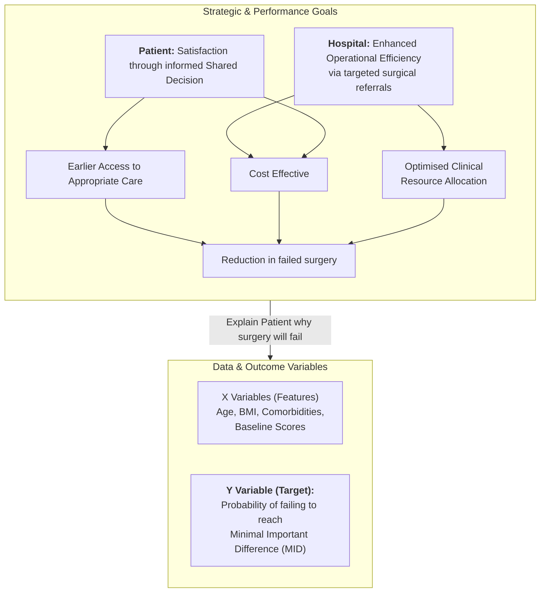

# DAPS Diagram for EAISI NHS PROMS Project

## Business Value
Our main goal is to reduce failure rates post-surgery after 1 year by predicting which patients will have poor outcomes from hip and knee replacement surgeries. This enables:
- Proactive identification of high-risk patients before surgery
- Informed clinical decision-making to potentially avoid unnecessary procedures
- Improved patient outcomes and satisfaction through better preoperative counseling
- Significant cost savings for the healthcare system by reducing failed surgeries and associated complications

